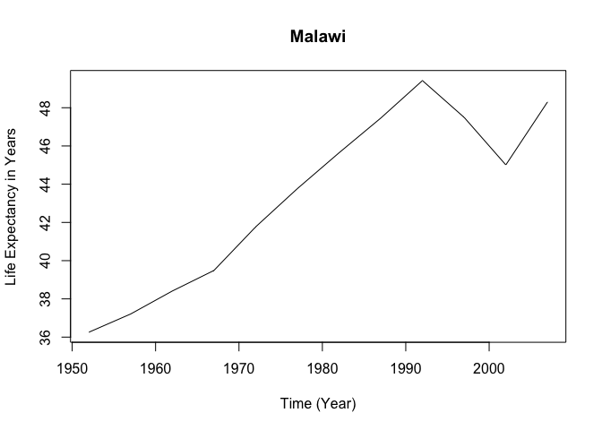
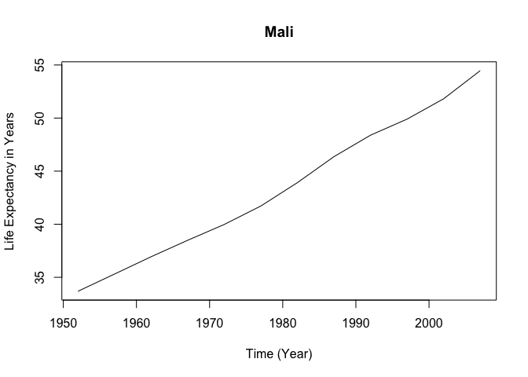
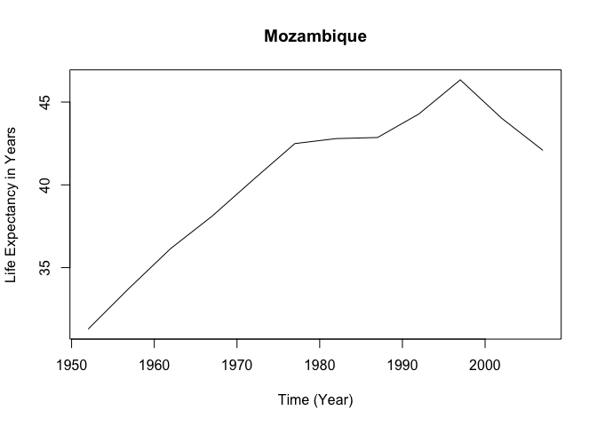

## Preparations

``` r
# load packages
library(tidyverse)
library(gapminder)
library(stringr)

# save data as data frame
data <- as.data.frame(gapminder)
```

## Task 1

**Define a defensive function that calculates the Gross Domestic Product
of a nation from the data available in the gapminder dataset. Using that
function, calculate the GDP of Denmark in the following years: 1967,
1977, 1987, 1997, 2007, and 2017.**

``` r
# definsive function 
gdp_calc <- function(data, country, year){
  stopifnot(country %in% data$country, # make sure the country is in the data
            year %in% data$year[data$country == country], # year for the country is in the data
            is.numeric(data$gdpPercap)) # make sure the GDP is numeric
  subset <- data[data$country == country & data$year == year,] # make subset of country and yeear
  gdp <- subset$gdpPercap*subset$pop # calcualte gpd 
  return(paste("GDP of", country, "in", year, "was", gdp)) #return it in a nice sentence
}

# calculate GDP for denmark in the following years
gdp_calc(data, "Denmark", 1967)
```

    ## [1] "GDP of Denmark in 1967 was 77116977699.724"

``` r
gdp_calc(data, "Denmark", 1977)
```

    ## [1] "GDP of Denmark in 1977 was 103920280027.729"

``` r
gdp_calc(data, "Denmark", 1987)
```

    ## [1] "GDP of Denmark in 1987 was 128771236166.089"

``` r
gdp_calc(data, "Denmark", 2007)
```

    ## [1] "GDP of Denmark in 2007 was 192906627080.569"

``` r
# gdp_calc(data, "Denmark", 2017) there is no value for 2017 in the data for Denmark
```

## Task 2

**Write a script that loops over each country in the gapminder dataset,
tests whether the country starts with a ‘B’ , and print out whether the
life expectancy is smaller than 50, between 50 and 70, or greater than
70.** \*Note: I was unsure whether life expectancy here means “mean life
expectancy” (just like in task 3) or whether it means “one of the life
expectancy values” - but I assumed the first one.

``` r
# print the life expectancy test if a country does start with B
for (country in unique(data$country)) {
  
  # if a country starts with B
  if (str_detect(country, "^B") == TRUE) {
    # calculate the mean life expectancy 
    mean_lifeExp <- mean(data$lifeExp[data$country == country])
    # and depending on the result print different things
    lifeExp <- ifelse(mean_lifeExp < 50, "smaller than 50.",
                  ifelse(mean_lifeExp > 50 & mean_lifeExp < 70, "between 50 and 70.", 
                  "greater than 70."))
    print(paste("In", country, "the mean life expectancy is", lifeExp))
    }
  }
```

    ## [1] "In Bahrain the mean life expectancy is between 50 and 70."
    ## [1] "In Bangladesh the mean life expectancy is smaller than 50."
    ## [1] "In Belgium the mean life expectancy is greater than 70."
    ## [1] "In Benin the mean life expectancy is smaller than 50."
    ## [1] "In Bolivia the mean life expectancy is between 50 and 70."
    ## [1] "In Bosnia and Herzegovina the mean life expectancy is between 50 and 70."
    ## [1] "In Botswana the mean life expectancy is between 50 and 70."
    ## [1] "In Brazil the mean life expectancy is between 50 and 70."
    ## [1] "In Bulgaria the mean life expectancy is between 50 and 70."
    ## [1] "In Burkina Faso the mean life expectancy is smaller than 50."
    ## [1] "In Burundi the mean life expectancy is smaller than 50."

## Optional: Task 3

**Write a script that loops over each country in the gapminder dataset,
tests whether the country starts with a ‘M’ and graphs life expectancy
against time (using plot() function) as a line graph if the mean life
expectancy is under 50 years.**

``` r
for (country in unique(data$country)) {
  if (str_detect(country, "^M") == TRUE & mean(data$lifeExp[data$country == country]) < 50) {
    subset <- data[data$country == country,]
    plot(y = subset$lifeExp, x = subset$year, 
         type = "l", 
         main = country, 
         ylab = "Life Expectancy in Years", 
         xlab = "Time (Year)")
  }
}
```

<!-- --><!-- --><!-- --><!-- -->
